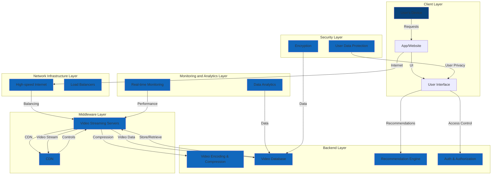

Architecture for improving video streaming:

| **Category**               | **Components**                               |
|---------------------------|---------------------------------------------|
| **Client-side**           | User's device (e.g., smartphone, PC),       |
|                           | Facebook's mobile app or website.           |
| **Frontend**              | Video Player Component,                     |
|                           | User Interface.                             |
| **Middleware**            | Content Delivery Network (CDN),             |
|                           | Video Streaming Servers.                    |
| **Backend**               | Video Encoding and Compression,             |
|                           | Video Database,                             |
|                           | Recommendation Engine,                     |
|                           | User Authentication and Authorization.      |
| **Network Infrastructure** | High-speed internet connections,            |
|                           | Load balancers for traffic distribution.    |
| **Monitoring and Analytics** | Real-time monitoring tools to track video performance, |
|                             | Data analytics for user engagement and quality improvement. |
| **Security**              | Encryption protocols for data security,      |
|                           | User data protection and privacy measures.   |

